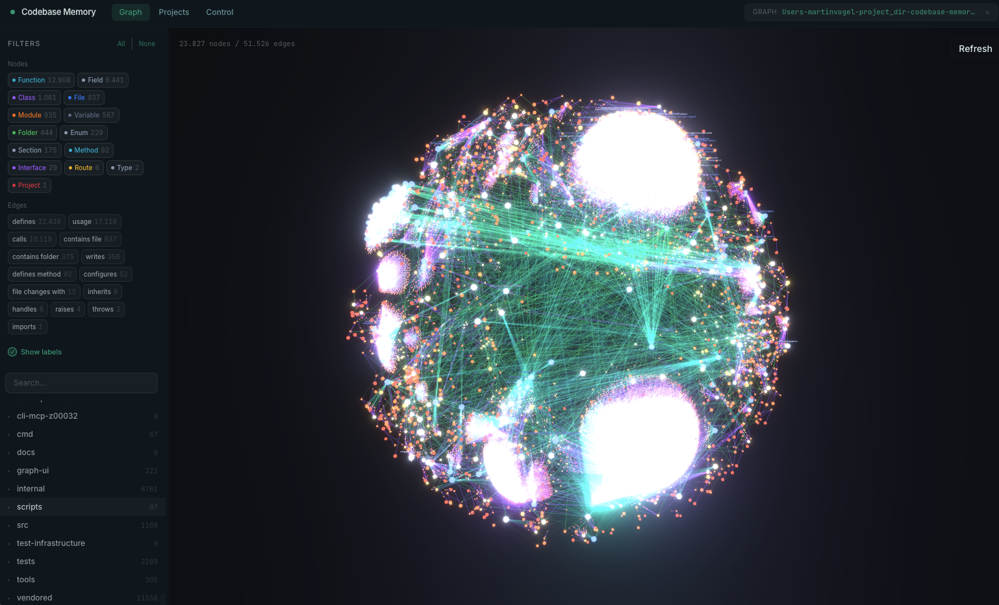

# Memora

<p align="center">
  
  <br>
  <em>Memora — grafo de conocimiento para agentes de IA</em>
</p>

**Memora** es un servidor MCP (Model Context Protocol) experimental construido sobre un motor de indexación semántica de código fuente. Su propósito es servir como banco de pruebas para investigar, prototipar y validar nuevas capacidades del protocolo MCP en entornos reales de ingeniería de software asistida por IA.

Mediante la construcción de un grafo de conocimiento persistente —con funciones, clases, cadenas de llamadas, rutas HTTP y relaciones entre módulos— Memora permite que agentes de IA naveguen y comprendan bases de código complejas con una eficiencia muy superior a la exploración archivo por archivo.

Este proyecto se utiliza activamente para experimentar con:

- **Descubrimiento estructural asistido por grafos**: cómo un grapo semántico puede reducir drásticamente el consumo de tokens en agentes de IA (hasta un 99.2 % frente a grep/glob secuencial).
- **Integración multiproveedor de MCP**: despliegue y evaluación del servidor en 40+ superficies de agente (Claude Code, Codex CLI, Gemini CLI, VS Code, Cursor, Windsurf, OpenCode, entre otros).
- **Perfiles de herramientas por niveles**: diseño de perfiles Scout, Verify y Auditor con distintos niveles de acceso a herramientas del grafo.
- **Vinculación entre repositorios**: seguimiento de llamadas HTTP y relaciones cross-repo a través de múltiples proyectos indexados.
- **Híbrido LSP embebido**: resolución semántica de tipos sin necesidad de servidores de lenguaje externos.

Para una descripción completa del conjunto original de funcionalidades, documentación técnica y benchmarks, consulte la [documentación del proyecto original](https://github.com/DeusData/codebase-memory-mcp).

## Inicio rápido

**Instalación en una línea** (macOS / Linux):
```bash
curl -fsSL https://raw.githubusercontent.com/TakaraDasein/memora/main/install.sh | bash
```

Con interfaz gráfica de visualización:
```bash
curl -fsSL https://raw.githubusercontent.com/TakaraDasein/memora/main/install.sh | bash -s -- --ui
```

**Windows** (PowerShell):
```powershell
Invoke-WebRequest -Uri https://raw.githubusercontent.com/TakaraDasein/memora/main/install.ps1 -OutFile install.ps1
Unblock-File .\install.ps1
.\install.ps1
```

Opciones: `--ui` (visualización de grafo), `--skip-config` (solo binario, sin configuración de agente), `--dir=<ruta>` (ubicación personalizada).

Reinicie su agente de IA. Diga **"Indexa este proyecto"** — listo.

<details>
<summary>Instalación manual</summary>

1. **Descargue** el archivo comprimido para su plataforma desde la [última versión](https://github.com/TakaraDasein/memora/releases/latest):
   - `memora-<os>-<arch>.tar.gz` (macOS/Linux) o `.zip` (Windows) — estándar
   - `memora-ui-<os>-<arch>.tar.gz` / `.zip` — con visualización de grafo

2. **Extraiga e instale** (cada archivo incluye `install.sh` o `install.ps1`):

   macOS / Linux:
   ```bash
   tar xzf memora-*.tar.gz
   ./install.sh
   ```

   Windows (PowerShell):
   ```powershell
   Expand-Archive memora-windows-amd64.zip -DestinationPath .
   Unblock-File .\install.ps1
   .\install.ps1
   ```

3. **Reinicie** su agente de IA.

El comando `install` elimina automáticamente atributos de cuarentena de macOS y firma el binario ad-hoc.
</details>

El comando `install` detecta automáticamente los agentes de IA instalados y configura sus entradas MCP documentadas, instrucciones persistentes, skills y hooks de ciclo de vida cuando son soportados.

### Interfaz de visualización de grafo

La interfaz gráfica se distribuye como una variante `ui` independiente. La instalación predeterminada en todos los canales es el servidor headless; opte por la interfaz gráfica con:

- **install.sh:** añada `--ui`
- **npm:** `CBM_VARIANT=ui npm install -g memora`
- **PyPI:** `CBM_VARIANT=ui pip install memora`
- **Manual:** descargue el archivo `memora-ui-<os>-<arch>`

Ejecútelo:

```bash
memora --ui=true --port=9749
```

Abra `http://localhost:9749` en su navegador. La interfaz se ejecuta como un hilo de fondo junto al servidor MCP.

### Indexación automática

Active la indexación automática al inicio de la sesión MCP:

```bash
memora config set auto_index true
```

Cuando está activada, los proyectos nuevos se indexan automáticamente en la primera conexión. Los proyectos previamente indexados se registran con el vigilante de fondo para la detección continua de cambios basada en git. Límite configurable: `config set auto_index_limit 50000`.

El registro del vigilante se controla por separado mediante `auto_watch` (valor predeterminado `true`). Establezca `config set auto_watch false` para evitar que una sesión registre su proyecto con el vigilante de fondo.

### Mantenerse actualizado

```bash
memora update
```

El servidor MCP también verifica actualizaciones al inicio y notifica en la primera llamada si hay una versión más reciente disponible.

### Desinstalación

```bash
memora uninstall
```

Elimina las entradas de configuración del agente, skills, hooks, instrucciones y el binario instalado. Los índices existentes se enumeran y eliminan solo tras confirmación.

## Funcionalidades

### Grafo y análisis
- **Visión general de arquitectura**: `get_architecture` devuelve lenguajes, paquetes, puntos de entrada, rutas, puntos críticos, límites, capas y clusters en una sola llamada.
- **Registros de decisiones de arquitectura**: `manage_adr` persiste decisiones arquitectónicas entre sesiones.
- **Detección de comunidades Louvain**: descubre módulos funcionales agrupando aristas de llamadas.
- **Mapeo de impacto git diff**: `detect_changes` mapea cambios no commiteados a símbolos afectados con clasificación de riesgo.
- **Grafo de llamadas**: resuelve llamadas a funciones entre archivos y paquetes (consciente de importaciones, con inferencia de tipos).
- **Detección de código muerto**: encuentra funciones con cero llamantes, excluyendo puntos de entrada.
- **Consultas estilo Cypher**: `MATCH (f:Function)-[:CALLS]->(g) WHERE f.name = 'main' RETURN g.name`

### Búsqueda
- **Búsqueda semántica** (`semantic_query`): búsqueda vectorial en todo el grafo impulsada por embeddings Nomic `nomic-embed-code` (40K tokens, 768d int8) compilados directamente en el binario — sin API key, sin Ollama, sin Docker. Puntuación combinada de 11 señales (TF-IDF, RRI, firmas API/Tipo/Decorador, perfiles AST, flujo de datos, Halstead-lite, MinHash, proximidad de módulos, difusión en el grafo).
- **Búsqueda BM25** mediante SQLite FTS5 con tokenizador `cbm_camel_split` (compatible con camelCase y snake_case).
- **Búsqueda estructural** (`search_graph`): patrones regex de nombre, filtros por etiqueta, grado mínimo/máximo, ámbito de archivo.
- **Búsqueda de código** (`search_code`): grep aumentado con el grafo sobre archivos indexados.

### Vinculación entre servicios
- **HTTP**: coincidencia de rutas con puntos de llamada y puntuación de confianza.
- **gRPC, GraphQL, tRPC**: detección de servicios con extracción de rutas desde protobuf.
- **Detección de canales** (`EMITS` / `LISTENS_ON`): para Socket.IO, EventEmitter y patrones pub-sub genéricos en 8 lenguajes con resolución de constantes.

### Inteligencia entre repositorios
- **Aristas `CROSS_*`**: enlazan nodos entre múltiples repositorios indexados bajo el mismo almacén.
- **Visualización 3D multi-galaxia**: diseño de interfaz para arquitectura entre repositorios.
- **Resumen de arquitectura cross-repo**: combina servicios, rutas y dependencias en toda la flota indexada.

### Tipos de arista (selección)
- `CALLS`, `IMPORTS`, `DEFINES`, `IMPLEMENTS`, `INHERITS`
- `HTTP_CALLS`, `ASYNC_CALLS` (entre servicios)
- `EMITS`, `LISTENS_ON` (canales)
- `DATA_FLOWS` con mapeo arg-to-param y cadenas de acceso a campos
- `SIMILAR_TO` (MinHash + LSH, detección de código casi duplicado, puntuación Jaccard)
- `SEMANTICALLY_RELATED` (diferencia de vocabulario, mismo lenguaje, puntuación ≥ 0.80)

### Pipeline de indexación
- **158 gramáticas tree-sitter** compiladas en el binario.
- **Resolución genérica de paquetes/módulos**: especificadores desnudos como `@myorg/pkg`, `github.com/foo/bar`, `use my_crate::foo` resueltos mediante escaneo de manifiestos.
- **Indexación de infraestructura como código**: Dockerfiles, manifiestos Kubernetes, overlays Kustomize como nodos del grafo.
- **Resolución semántica de tipos híbrida LSP**: implementación ligera en C de algoritmos de resolución de tipos estructuralmente inspirada en y compatible con tsserver, pyright, gopls, Roslyn, Eclipse JDT y rust-analyzer.
- **Pipeline primero en RAM**: compresión LZ4, SQLite en memoria, volcado único al final.

### Distribución y operación
- **Binario estático único, cero infraestructura**: respaldado por SQLite, persiste en `~/.cache/memora/`.
- **Sincronización automática**: vigilante de fondo que detecta cambios en archivos y re-indexa automáticamente.
- **Nodos de ruta**: los endpoints REST son entidades de primera clase en el grafo.
- **Modo CLI**: `memora cli search_graph '{"project": "mi-proyecto", "name_pattern": ".*Handler.*"}'`
- **Disponible en**: npm, PyPI, Homebrew, Scoop, Winget, Chocolatey, AUR, `go install`.

## Artefacto de grafo compartido en equipo

Confíe un solo archivo comprimido a su repositorio y sus compañeros de equipo se saltan la re-indexación completa.

`.codebase-memory/graph.db.zst` es una instantánea comprimida con zstd del grafo de conocimiento que vive junto a su código fuente. Cuando indexa, el artefacto se escribe o actualiza; cuando un compañero clona el repositorio y ejecuta `memora` por primera vez, el artefacto se descomprime y la indexación incremental completa su diff local.

- **Formato**: base de datos SQLite, índices eliminados, compactado con `VACUUM INTO`, comprimido con zstd 1.5.7 (relación de compresión típica 8–13:1).
- **Dos niveles**:
  - **Mejor** (`zstd -9` + eliminación de índices + `VACUUM INTO`) — escrito en `index_repository` explícito.
  - **Rápido** (`zstd -3`) — escrito por el vigilante para actualizaciones incrementales de baja latencia.
- **Arranque**: cuando no existe una base de datos local pero el artefacto está presente, `index_repository` importa primero el artefacto y luego ejecuta indexación incremental.
- **Sin conflictos de fusión**: se crea automáticamente una línea `.gitattributes` con `merge=ours` en la primera exportación.
- **Opcional**: nunca se confía a menos que quiera. Añada `.codebase-memory/` a `.gitignore` si prefiere que todos re-indexen desde cero.

## Cómo funciona

Memora es un **motor de análisis estructural**: construye y consulta el grafo de conocimiento. No incluye un LLM. En su lugar, delega en su cliente MCP (Claude Code, o cualquier agente compatible con MCP) como capa de inteligencia.

```
Usted: "¿qué llama a ProcessOrder?"

Agente llama a: trace_path(function_name="ProcessOrder", direction="inbound")

Memora: ejecuta la consulta al grafo, devuelve resultados estructurados

Agente: presenta la cadena de llamadas en lenguaje natural
```

**¿Por qué no tiene LLM incorporado?** Otras herramientas de grafo de código embeben un LLM para la traducción de lenguaje natural a consultas. Esto implica claves API adicionales, costos extra y otro modelo que configurar. Con MCP, el agente con el que ya está conversando *es* el traductor de consultas.

## Rendimiento

Benchmarks en Apple M3 Pro:

| Operación | Tiempo | Notas |
|-----------|--------|-------|
| **Índice completo del kernel Linux** | **3 min** | 28M LOC, 75K archivos → 4.81M nodos, 7.72M aristas |
| Índice rápido del kernel Linux | 1m 12s | 1.88M nodos |
| Índice completo de Django | ~6s | 49K nodos, 196K aristas |
| Consulta Cypher | <1ms | Recorrido de relaciones |
| Búsqueda por nombre (regex) | <10ms | Prefiltrado SQL LIKE |
| Detección de código muerto | ~150ms | Escaneo completo del grafo con filtrado de grado |
| Trazar ruta de llamadas (profundidad=5) | <10ms | Recorrido BFS |

**Pipeline primero en RAM**: toda la indexación se ejecuta en memoria (lectura comprimida LZ4 HC, SQLite en memoria, volcado único al final). La memoria se libera al sistema operativo tras completar la indexación.

**Eficiencia de tokens**: cinco consultas estructurales consumieron ~3400 tokens mediante Memora frente a ~412 000 tokens mediante exploración archivo por archivo con grep — una **reducción del 99.2 %**.

## Solución de problemas y diagnóstico

Memora se ejecuta **100 % local y no recopila telemetría**: su código, consultas, entorno y uso nunca abandonan su máquina.

### Capturar un registro de diagnóstico

Establezca `CBM_DIAGNOSTICS=1` antes de que el servidor MCP se inicie, luego reproduzca el problema. El servidor escribe dos archivos en el directorio temporal del sistema:

| Archivo | Qué es |
|---------|--------|
| `cbm-diagnostics-<pid>.ndjson` | **La trayectoria de memoria**: una línea JSON cada 5 s con `rss`, `committed`, `peak_*`, `page_faults`, `fd` y `queries`. |
| `cbm-diagnostics-<pid>.json` | La instantánea más reciente. |

### Qué compartir

Cuando abra un problema de memoria o rendimiento, adjunte la trayectoria `.ndjson`.

## Instalación

### Binarios precompilados

| Plataforma | Estándar | Con interfaz gráfica |
|------------|----------|----------------------|
| macOS (Apple Silicon) | `memora-darwin-arm64.tar.gz` | `memora-ui-darwin-arm64.tar.gz` |
| macOS (Intel) | `memora-darwin-amd64.tar.gz` | `memora-ui-darwin-amd64.tar.gz` |
| Linux (x86_64) | `memora-linux-amd64.tar.gz` | `memora-ui-linux-amd64.tar.gz` |
| Linux (ARM64) | `memora-linux-arm64.tar.gz` | `memora-ui-linux-arm64.tar.gz` |
| Windows (x86_64) | `memora-windows-amd64.zip` | `memora-ui-windows-amd64.zip` |

Cada versión incluye `checksums.txt` con hashes SHA-256. Todos los binarios están enlazados estáticamente.

### Scripts de instalación

<details>
<summary>Descarga + instalación automatizada</summary>

**macOS / Linux:**

```bash
curl -fsSL https://raw.githubusercontent.com/TakaraDasein/memora/main/scripts/setup.sh | bash
```

**Windows (PowerShell):**

```powershell
irm https://raw.githubusercontent.com/TakaraDasein/memora/main/scripts/setup-windows.ps1 | iex
```

</details>

### AUR (Arch Linux)

```bash
yay -S memora-bin
```

### Compilar desde fuente

<details>
<summary>Requisitos: compilador de C + zlib</summary>

| Requisito | Verificación | Instalación |
|-----------|-------------|-------------|
| **Compilador C** (gcc o clang) | `gcc --version` o `clang --version` | macOS: `xcode-select --install`, Linux: `apt install build-essential` |
| **Compilador C++** | `g++ --version` o `clang++ --version` | Igual que arriba |
| **zlib** | — | macOS: incluido, Linux: `apt install zlib1g-dev` |
| **Git** | `git --version` | Preinstalado en la mayoría de sistemas |

</details>

```bash
git clone https://github.com/TakaraDasein/memora.git
cd memora
scripts/build.sh                     # binario estándar
scripts/build.sh --with-ui           # con visualización de grafo
# Binario en: build/c/memora
```

### Configuración manual de MCP

<details>
<summary>Si prefiere no usar el comando install</summary>

Añada a `~/.claude.json` (ámbito de usuario) o `.mcp.json` del proyecto:

```json
{
  "mcpServers": {
    "memora": {
      "command": "/ruta/a/memora",
      "args": []
    }
  }
}
```

Reinicie su agente. Verifique con `/mcp` — debería ver `memora` con 15 herramientas.

</details>

## Modo CLI

Toda herramienta MCP puede invocarse desde la línea de comandos:

```bash
memora cli index_repository '{"repo_path": "/ruta/al/repo"}'
memora cli list_projects
memora cli search_graph '{"project": "mi-proyecto", "name_pattern": ".*Handler.*", "label": "Function"}'
memora cli trace_path '{"project": "mi-proyecto", "function_name": "Search", "direction": "both"}'
memora cli query_graph '{"project": "mi-proyecto", "query": "MATCH (f:Function) RETURN f.name LIMIT 5"}'
```

## Herramientas MCP

### Indexación

| Herramienta | Descripción |
|-------------|-------------|
| `index_repository` | Indexa un repositorio en el grafo. La sincronización automática lo mantiene actualizado. |
| `list_projects` | Lista todos los proyectos indexados con conteo de nodos/aristas. |
| `delete_project` | Elimina un proyecto y todos sus datos del grafo. |
| `index_status` | Verifica el estado de indexación de un proyecto. |

### Consulta

| Herramienta | Descripción |
|-------------|-------------|
| `search_graph` | Búsqueda estructurada por etiqueta, patrón de nombre, patrón de archivo, filtros de grado. Paginación mediante limit/offset. |
| `trace_path` | Recorrido BFS: quién llama a una función y qué llama ella (alias: `trace_call_path`). Profundidad 1-5. |
| `detect_changes` | Mapea git diff a símbolos afectados + radio de explosión con clasificación de riesgo. |
| `query_graph` | Ejecuta consultas estilo Cypher (solo lectura). |
| `get_graph_schema` | Conteos de nodos/aristas, patrones de relación, definiciones de propiedades por etiqueta. |
| `get_code_snippet` | Lee código fuente de una función por nombre cualificado. |
| `get_architecture` | Visión general del código: lenguajes, paquetes, rutas, puntos críticos, clusters, ADR. |
| `search_code` | Búsqueda tipo grep dentro de archivos de proyectos indexados. |
| `manage_adr` | CRUD para Registros de Decisiones de Arquitectura. |
| `ingest_traces` | Ingresa trazas de ejecución para validar aristas HTTP_CALLS. |

## Modelo de datos del grafo

### Etiquetas de nodo

`Project`, `Package`, `Folder`, `File`, `Module`, `Class`, `Function`, `Method`, `Interface`, `Enum`, `Type`, `Route`, `Resource`

### Tipos de arista

`CONTAINS_PACKAGE`, `CONTAINS_FOLDER`, `CONTAINS_FILE`, `DEFINES`, `DEFINES_METHOD`, `IMPORTS`, `CALLS`, `HTTP_CALLS`, `ASYNC_CALLS`, `IMPLEMENTS`, `HANDLES`, `USAGE`, `CONFIGURES`, `WRITES`, `MEMBER_OF`, `TESTS`, `USES_TYPE`, `FILE_CHANGES_WITH`

### Nombres cualificados

`get_code_snippet` usa nombres cualificados: `<proyecto>.<partes_ruta>.<nombre>`. Use `search_graph` para descubrirlos primero.

### Subconjunto Cypher soportado (openCypher solo lectura)

`query_graph` es un subconjunto openCypher de solo lectura con cláusulas `MATCH`, `OPTIONAL MATCH`, `WHERE`, `WITH`, `RETURN`, `ORDER BY`, `SKIP`, `LIMIT`, `DISTINCT`, `UNWIND`, `UNION`/`UNION ALL`, `CASE`, y funciones de agregación y cadena.

## Ignorar archivos

En capas: patrones fijos (`.git`, `node_modules`, etc.) → jerarquía `.gitignore` → `.cbmignore` (específico del proyecto, sintaxis gitignore). Los enlaces simbólicos siempre se omiten.

Vea [docs/cbmignore.md](docs/cbmignore.md) para el manual completo de `.cbmignore`.

## Configuración

```bash
memora config list                           # muestra toda la configuración
memora config set auto_index true            # indexación automática al inicio
memora config set auto_index_limit 50000     # máximo de archivos para auto-index
memora config set auto_watch false           # no registrar vigilante git (predet: true)
memora config reset auto_index               # restablecer a valor predeterminado
```

### Variables de entorno

| Variable | Predeterminado | Descripción |
|----------|---------------|-------------|
| `CBM_ALLOWED_ROOT` | *(sin definir)* | Restringe `index_repository` a rutas dentro de este directorio. |
| `CBM_CACHE_DIR` | `~/.cache/memora` | Sobrescribe el directorio de almacenamiento de la base de datos. |
| `CBM_DIAGNOSTICS` | `false` | Establezca a `1` o `true` para activar la salida periódica de diagnóstico. |
| `CBM_DOWNLOAD_URL` | *(GitHub releases)* | Sobrescribe la URL de descarga para actualizaciones. |
| `CBM_LOG_LEVEL` | `info` | Nivel mínimo de registro: `debug`, `info`, `warn`, `error`, `none`. |
| `CBM_WORKERS` | *(detectado)* | Sobrescribe el número de trabajadores de indexación paralela. |
| `CBM_MEM_BUDGET_MB` | *(detectado)* | Sobrescribe el presupuesto de memoria del grafo en MiB. |
| `CBM_DUMP_VERIFY_MIN_RATIO` | `0.5` | Umbral de verificación de persistencia post-indexación. |

## Extensiones de archivo personalizadas

Los archivos de configuración JSON soportan una clave `extra_extensions` que mapea extensiones de archivo adicionales a lenguajes soportados.

**Por proyecto** (en la raíz del repositorio):
```json
// .codebase-memory.json
{"extra_extensions": {".blade.php": "php", ".mjs": "javascript"}}
```

**Global** (aplica a todos los proyectos):
```json
// ~/.config/memora/config.json  (o $XDG_CONFIG_HOME/...)
{"extra_extensions": {".twig": "html", ".phtml": "php"}}
```

## Persistencia

Bases de datos SQLite almacenadas en `~/.cache/memora/`. Persisten entre reinicios (modo WAL, ACID-safe). Para restablecer: `rm -rf ~/.cache/memora/`.

## Solución de problemas rápida

| Problema | Solución |
|----------|----------|
| `/mcp` no muestra el servidor | Verifique que la ruta en `.mcp.json` sea absoluta. Reinicie el agente. |
| `index_repository` falla | Use ruta absoluta: `index_repository(repo_path="/ruta/absoluta")` |
| `trace_path` devuelve 0 resultados | Use `search_graph(name_pattern=".*NombreParcial.*")` primero. |
| Consultas devuelven proyecto incorrecto | Añada `project="nombre"`. Use `list_projects` para ver los nombres. |
| Binario no encontrado tras instalar | Añada al PATH: `export PATH="$HOME/.local/bin:$PATH"` |
| La interfaz no carga | Asegúrese de descargar la variante `ui` y ejecutar con `--ui=true`. |

## LSP Híbrido

**Resolución semántica de tipos más allá de tree-sitter.**

Memora incorpora una **implementación ligera en C de algoritmos de resolución de tipos**, estructuralmente inspirada en y compatible con los principales servidores de lenguaje (tsserver/typescript-go, pyright, gopls, Roslyn, Eclipse JDT, rust-analyzer), embebida directamente en el binario estático. Sin proceso de servidor de lenguaje, sin configuración por proyecto, sin clave API.

**Lenguajes con LSP Híbrido completo:**

| Lenguaje | Qué maneja |
|----------|------------|
| **Python** | imports + submodule walks, dataclasses, `Self`, genéricos, `@property`, `match/case`, SQLAlchemy 2.0 `Mapped[T]`, Pydantic `BaseModel`, narrowing, stdlib común. |
| **TypeScript / JavaScript / JSX / TSX** | genéricos, dispatch de componentes JSX, inferencia JSDoc, declaraciones `.d.ts`, re-exportaciones, encadenamiento de métodos. |
| **PHP** | namespaces, traits, late-static-binding, inferencia PHPDoc, bindings de parámetros. |
| **C#** | usings globales, namespaces de ámbito de archivo, records (incl. constructores primarios C# 12), sintaxis LINQ, `async Task<T>`/`ValueTask<T>`, genéricos. |
| **Go** | registro cross-file por paquete, genéricos, structs embebidos, satisfacción de interfaces. |
| **C / C++** | macros + cadenas `typedef` + enlace header-vs-source (C); plantillas, namespaces, inferencia `auto`, resolución por jerarquía de clases (C++). |
| **Java** | imports, jerarquías de clases, genéricos, anotaciones, sobrecarga, lambdas/method references, inferencia de tipos de campo, JDK stdlib. |
| **Kotlin** | imports, clases/objetos/companion objects, funciones de extensión, data classes, nullable types, scope functions, llamadas infix. |
| **Rust** | declaraciones `use` + rutas de módulos, bloques `impl` y trait methods, campos de struct, genéricos con trait bounds, derive macros, UFCS. |
| **Perl** | paquetes + herencia `@ISA`/`use parent`, `SUPER::`, Exporter, self-type inference, llamadas estáticas cualificadas. |

**Arquitectura de dos capas:**

1. **Pasada tree-sitter** — rápida, sintáctica, para los 158 lenguajes.
2. **Pasada LSP Híbrido** — consciente de tipos, refina las aristas de llamadas usando el grafo de importaciones y un registro de definiciones.

## Soporte de lenguajes

158 lenguajes, todos analizados mediante gramáticas tree-sitter compiladas en el binario.

| Nivel | Puntuación | Lenguajes |
|-------|-----------|-----------|
| **Excelente** (>= 90 %) | | Lua, Kotlin, C++, Perl, Objective-C, Groovy, C, Bash, Zig, Swift, CSS, YAML, TOML, HTML, SCSS, HCL, Dockerfile |
| **Bueno** (75-89 %) | | Python, TypeScript, TSX, Go, Rust, Java, R, Dart, JavaScript, Erlang, Elixir, Scala, Ruby, PHP, C#, SQL |
| **Funcional** (< 75 %) | | OCaml, Haskell |

Además de lenguajes adicionales como Ada, Agda, Astro, Cairo, Clojure, COBOL, Elm, Erlang, F#, Fortran, Gleam, GraphQL, Julia, Kotlin, Nix, PowerShell, Protobuf, Svelte, Vue, y muchos más.

## Arquitectura del código

```
src/
  main.c               Punto de entrada (servidor MCP stdio + CLI + install/update/config)
  mcp/                 Servidor MCP (15 herramientas, JSON-RPC 2.0, detección de sesión, auto-index)
  cli/                 Install/uninstall/update/config (43 superficies de cliente, hooks, instrucciones)
  store/               Almacenamiento SQLite del grafo (nodos, aristas, recorrido, búsqueda, Louvain)
  pipeline/            Indexación multipaso (estructura → definiciones → llamadas → HTTP → config → tests)
  cypher/              Léxico, parser, planificador, ejecutor de consultas Cypher
  discover/            Descubrimiento de archivos (.gitignore, .cbmignore, manejo de symlinks)
  watcher/             Sincronización automática de fondo (git polling, intervalos adaptativos)
  traces/              Ingreso de trazas de ejecución
  ui/                  Servidor HTTP embebido + visualización 3D del grafo
  foundation/          Abstracciones de plataforma (hilos, sistema de archivos, logging, memoria)
internal/cbm/          Gramáticas tree-sitter vendidas (158 lenguajes) + motor de extracción AST
```

## Seguridad

Cada versión se verifica mediante un pipeline multicapa antes de su publicación:

- **VirusTotal** — todos los binarios escaneados por 70+ motores antivirus (cero detecciones requerido para publicar).
- **SLSA Level 3** — procedencia criptográfica de la compilación generada por GitHub Actions.
- **Sigstore cosign** — firmas sin clave en todos los artefactos.
- **SHA-256 checksums** — `checksums.txt` publicado con cada versión.
- **CodeQL SAST** — bloquea el pipeline si hay alertas abiertas.
- **Cero dependencias en tiempo de ejecución** — sin cadena de suministro transitiva.

---

Memora es un *fork* de [codebase-memory-mcp](https://github.com/DeusData/codebase-memory-mcp) de DeusData, un servidor MCP que construye y consulta un grafo semántico del código fuente. Este fork mantiene toda la potencia del proyecto original —indexación completa de repositorios en milisegundos, un grafo de conocimiento persistente con funciones, clases, cadenas de llamadas, rutas HTTP y 15 herramientas MCP— y lo extiende con una interfaz monocromática personalizada para su uso como plataforma de experimentación con el protocolo MCP.

## Licencia

MIT
